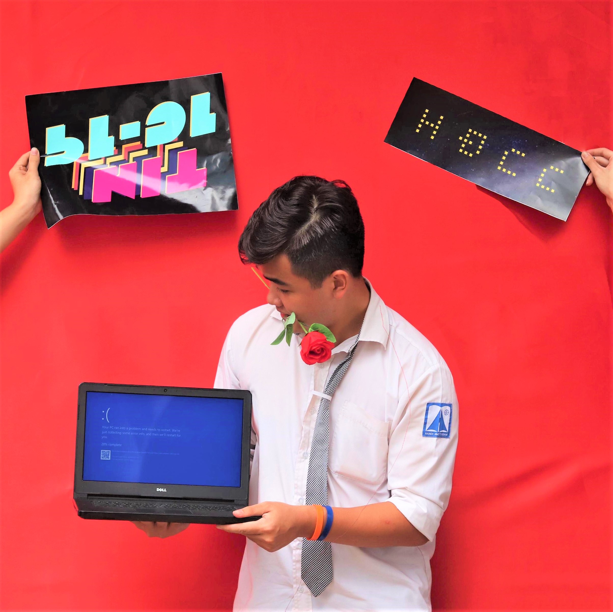

[Về trang chủ](./index.html)

> Play it with your strength. Don't try to climb trees if you're a fish, or don't try to tán gái if you're Lơ.

### Thông tin cá nhân

- Tên: Tô Tuấn Dũng (a.k.a.: Daniel To khi đi du học)

- D.O.B.: 18.03.2001 (Song Ngư)

- Nơi sinh: Hà Nội, Việt Nam. 

- Nơi ở hiện tại: Hà Nội, Vancouver.

- Sở thích 

    1.  Lập trình thi đấu.
    2.  Âm nhạc.
    3.  Thể thao (Bóng đá, bi-a, bóng bàn). (30% là xem, 70% còn lại là để khoe các bạn mình xem)

### 90s giới thiệu bản thân như trong các buổi phỏng vấn

Chào các đồng chí, mình là Lơ.

Trong quá khứ, tên tuổi mình thường đi với những giải đấu khác nhau từ cấp độ thành phố đến quốc tế, ở hai bộ môn là Toán học và Tin học. Cho dù ở thực tại thì những danh hiệu đó không còn quá ý nghĩa (ngoài việc mình nhìn vào và tự động viên bản thân mình ra), nhưng qua quãng thời gian luyện xong thi xong luyện xong thi, mình đã tôi rèn được cái tinh thần chiến đấu và bản tính hiếu thắng của bản thân mình.

Khá là may mắn, mình giỏi và đam mê ở cùng một thứ nên mình đã định hướng được rất sớm về nghề nghiệp của mình sau này. Mình sẽ làm kỹ sư phần mềm (Software Engineer), hoặc cái gì đó tương tự. Ở một phương diện khác, mình vẫn còn như là một cậu thiếu niên 15, 16 tuổi trong vẻ ngoài của ông 30 á :)) Mình khá tự ti về khả năng nói chuyện của mình, trừ những lúc mình thực sự thấy thoải mái, và tính khí đôi lúc cũng rất thất thường nữa. -.-

Nhưng mình sẽ không nói là bản thân mình chậm lớn hay kém cỏi. Mình đang trên con đường tìm hiểu bản thân. Mỗi con người trong chúng ta là một màu sắc khác nhau, và không ai giống một ai hết. Và chỉ cần cảm nhận được thật sâu sắc về con người mình thôi, chúng ta sẽ đạt được một cuộc sống hạnh phúc và dễ dàng hơn rất nhiều.

### Tại sao lại có Lơ After Midnight

Như mình nói bên trên, mình đang trên con đường tìm hiểu bản thân.

Mình sẽ coi cái trang blog này như một cuốn nhật ký, tương tự như [page facebook của mình](https://facebook.com/cplgmdanielt), nhưng sẽ viết về những thứ sâu sắc hơn so với việc tấu hài hay share vài quote phim hay ho ngớ ngẩn. Đôi khi có cảm hứng, mình sẽ viết để chia sẻ về kiến thức mình học được liên quan đến toán hay khoa học máy tính, hoặc viết lời giải một đề thi thú vị mình đọc được. Còn lại, đa phần, mình muốn viết nhiều hơn về cuộc sống, phân tích các góc nhìn về những thứ rất đời thường như là khác biệt văn hóa Tây - Ta hay tại sao mình ghét chỗ đông người.

Điều mình muốn đạt được qua việc viết lách này đó chính là kết nối và tìm kiếm sự đồng cảm từ những người đến với Lơ After Midnight. Đồng thời, mình muốn lắng nghe và học tập nhiều hơn về những suy nghĩ khác nhau, những quan điểm trái chiều trong cuộc sống. Từ trước, mình luôn chú tâm vào phần chuyên môn của mình, nhưng rồi coi thường những điều nhỏ bé xung quanh mình, để rồi cuối cùng vướng bận vào những câu chuyện vô nghĩa, hay lao vào những mối quan hệ độc hại, vô ích. 

> "Look, the point is people improve when they get external love and support."
>
> -Michael (The Good Place ss4)

Có người bảo mình chỉ biết suy nghĩ, biết nói chứ không biết đi đôi với hành động. Ừm, có thể điều đó đúng. Nhưng mình chắc chắn một điều là nếu không có một suy nghĩ chín chắn, bạn sẽ không thể hành động đúng được. Thế nên, mình coi những dòng suy nghĩ này là một bước đệm, một "work in progress" để tiến đến phiên bản hoàn thiện nhất của bản thân mình.

### Kết nối với mình nèk

* [Facebook Page](https://facebook.com/cplgmdanielt)
* [Facebook Cá Nhân](https://www.facebook.com/lowieeee)
* [Instagram](https://www.instagram.com/daniel_to.cpp)
* [GitHub](https://github.com/lowie1803)
* [Codeforces](https://codeforces.com/profile/low_)
* [Gmail](mailto://dung.totuan01@gmail.com)
* [Gmail (Công Việc)](mailto://ttuandung1803@gmail.com)
* [Outlook](mailto://daniel.lowie.to@outlook.com)

[CV xin việc của mình](./ToTuanDungCV.pdf) (dành cho các nhà tuyển dụng hoặc các bạn tìm CV mẫu)